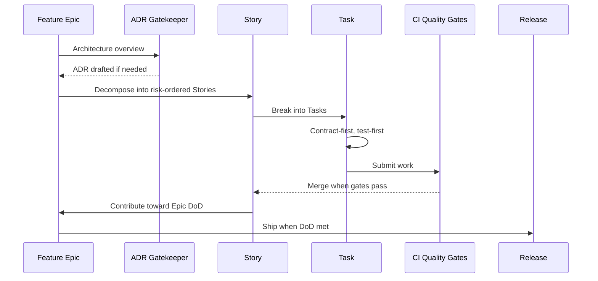

# AI-Driven Development (AIDD)

A lean, Claude Code-native methodology for AI-assisted software development. Slash commands plan epics, decompose stories, draft ADRs, and assemble PRs; hooks enforce traceability; humans own architectural decisions.

## Work hierarchy

| Type | Scope | Granularity |
|------|-------|-------------|
| **Epic** | Production-ready feature | Multiple Stories |
| **Story** | Vertical slice of functionality | PR-sized, carries acceptance criteria |
| **Task** | Single prompt or small dev action | Within one Story |
| **ADR** | Architecture Decision Record | Created when contracts/infra/persistence change |

## Pipeline



## Getting started

### For Claude Code users

1. Clone this repo (or copy its structure into your project).
2. `CLAUDE.md` auto-loads on every conversation, teaching Claude the AIDD methodology.
3. Use the built-in slash commands:

| Command | Purpose |
|---------|---------|
| `/plan-epic <description>` | Decompose a feature into risk-ordered Stories |
| `/plan-story <description>` | Break a Story into ordered, test-first Tasks |
| `/draft-adr <change>` | Evaluate if a change needs an ADR; draft one if so |
| `/submit-pr` | Generate a PR body from the current diff |

4. Hooks in `.claude/settings.json` automatically warn on:
   - Commits missing Story/Task references
   - Architectural file changes without ADR references

### For other AI tools

The methodology in `CLAUDE.md` is plain Markdown and works as context for any AI assistant. Feed it as a system prompt or project instructions file.

## Bootstrap prompts

### Fresh project

```
Review https://github.com/crashtestbrandt/AIDD and its CLAUDE.md.

This repository needs to follow the AIDD framework. Generate an implementation
plan covering: folder layout, templates, quality gates, slash commands, and
how to maintain consistency with the AIDD methodology over time.
```

### Existing project

```
Review https://github.com/crashtestbrandt/AIDD and its CLAUDE.md.

Adapt this project to comply with the AIDD framework. Produce a phased plan:
Phase 1 (quick wins), Phase 2 (deeper integration), Phase 3 (process embedding).
Include a baseline assessment of what already aligns and what's missing.
```

## Repository structure

```
CLAUDE.md                              # Methodology definition (auto-loaded by Claude Code)
README.md                              # This file
.claude/
  settings.json                        # Hooks + config
  commands/                            # Slash commands
scripts/hooks/                         # Hook scripts for commit validation
.github/
  pull_request_template.md             # PR template
  ISSUE_TEMPLATE/                      # Epic, Story, Task templates
  workflows/
    pr-quality-gates.yml               # CI quality gates
    framework-smoke-tests.yml          # Framework file validation
docs/adr/                              # Architecture Decision Records
```
