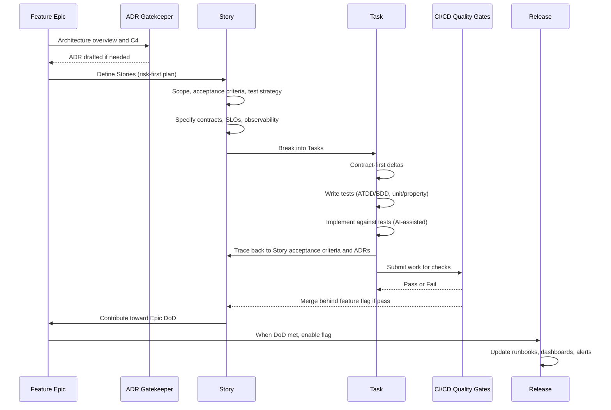

<!-- ./README.md -->

# AI-Driven Development (AIDD) Pipeline

> This repository defines a lightweight, opinionated framework for running modern software delivery with AI in the loop.
> It combines Agile issue types (Feature Epic → Story → Task) with DevOps best practices (contracts, tests, observability, quality gates) and adds AI-specific guidance for prompts, evaluation, and governance.
>
> The goal is to make AI agents first-class contributors: they draft ADRs, contracts, tests, and scaffolding, while humans approve, refine, and own architectural decisions. Each Task is a per-prompt unit of work, Stories are PR-sized slices of functionality, and Feature Epics anchor production-ready features with architecture and traceability.
>
> With templates, prompts, and CI/CD workflows included, this repo provides a repeatable structure where AI tools, developers, and quality gates all align to produce safe, testable, and shippable software.

---

* [Concepts](#concepts)
* [Pipeline Overview](#pipeline-overview)
* [Guidance](#guidance)
  * [PROMPTS.md](./PROMPTS.md)
* [Quality Gates](#quality-gates)
  * [GATES.md](./GATES.md)
* [Templates](#templates)
  * [TEMPLATES.md](./TEMPLATES.md)

---

## Concepts

### Issue Types

These align with Scrum/Agile usage: Epics group Stories, Stories decompose into Tasks. The twist is AI-driven “per-prompt” tasks.

* **Feature Epic**  
  A production-ready feature composed of multiple stories. Anchors architecture, ADRs, and traceability. Lives across multiple sprints if needed.

* **Story**  
  A PR-sized unit of work. Represents a coherent slice of functionality (often vertical: UI → API → DB). Carries acceptance criteria, tests, and contracts.

* **Task**  
  A per-prompt unit of work. Represents one or a few changes or tool runs that move a story forward (e.g., generating a contract, writing unit tests, updating a migration script). Multiple tasks roll into a story.

  > Tasks never ship user-visible behavior alone; Stories do.

### Related/Adjacent

* **Architecture Decision Record (ADR)**  
  Lightweight record of significant design choices. Linked from Epics and Stories for traceability. AI may draft; humans approve and commit.

* **C4 Model**  
  Context → Container → Component diagrams used at the Feature Epic level to clarify architecture scope (code-level diagrams optional).

* **Definition of Ready (DoR)**  
  Entry criteria for starting work on a Story/Task (e.g., acceptance criteria written, contracts drafted, risks identified).

* **Definition of Done (DoD)**  
  Exit criteria ensuring quality gates are met (tests passing, coverage thresholds, observability signals, docs updated).

* **Contracts**  
  Shared API/interface schemas (OpenAPI, GraphQL SDL, Protobuf, etc.) used as the source of truth for Story/Task implementation, with an explicit compatibility policy (backward/forward) and deprecation timelines.

* **Quality Gates**  
  Automated checks in CI/CD that enforce coverage, mutation scores, security scanning, AI eval scores, and performance budgets.

* **Feature Flags**  
  Mechanism for merging incomplete work safely. All Stories should be gated behind flags with rollback support.

* **AI Governance**  
  Policies and evaluation suites for prompts, models, and toolchains (prompt registry, eval harness, adversarial/jailbreak tests).

---

## Pipeline Overview

**Sequence Diagram**

**For each Feature Epic**

* **Architecture Overview + ADRs**  
  * Draft ADRs for each significant architectural choice (**AI**); review and commit (**human**).
  * Link ADR IDs and impacted C4 elements to establish architecture conformance & traceability.
  * Produce a lightweight C4 overview (context/container/component).

* **Implementation Plan (story-level)**  
  * You + AI: Generate an incremental, risk-first plan consisting of multiple **Stories**.  
  * Each Story must show how it aligns with the Epic’s architecture and objectives.

---

**For each Story**

* **Story Plan**  
  * You + AI: Define scope, acceptance criteria, and test strategy.  
  * You + AI: Specify contracts (OpenAPI/Protobuf/GraphQL SDL) as **source of truth** with versioning & deprecation policy, plus SLAs/SLOs and observability signals (with cardinality budgets and stable naming). 
  * AI: Break work into **Tasks** that each map to acceptance criteria.
  * You + AI: Establish DoR/DoD upfront.

---

**For each Task**

* **Task Execution**  
  * AI: Propose contract-first changes (API/interface deltas). **You approve schema PRs.** 
  * AI: Draft acceptance tests (ATDD/BDD optional) and unit/property tests before implementation.  
  * AI: Generate scaffolding and implement against those tests; **you review** for conformance to Story/ADR, then run smoke/sanity checks.
  * Tasks are traceable back to Story acceptance criteria and Feature Epic ADRs.  

---

## Guidance

See [PROMPTS.md](./PROMPTS.md).

**Prompting & Tooling**

* Use AI copilots/agents for:
  * Drafting contracts (OpenAPI/Proto/GraphQL).
  * Generating unit/property/BDD test stubs.
  * Suggesting scaffolding for migrations or integrations.
  * Autofixing lint/SAST findings with human review.
  * Drafting changelogs, ADR summaries, or runbooks.

* Prompt hygiene:
  * Store prompts in a **Prompt Registry** under prompts/ with semantic versions (e.g., auth/1.2.0.md). 
  * Treat prompts as code (reviewable, testable, diffable).  
  * Use structured prompts for repeatable outputs (YAML/JSON schemas).  

* Evaluation harness:
  * Run golden test sets for AI-generated outputs (correctness, style, security).  
  * Enforce non-regression with eval scores in CI/CD.  

---

**Testing Pyramid**

* **Unit & property tests** at the base (fast, automated).  
* **Contract & integration slice tests** in the middle.  
* **End-to-end acceptance tests** at the top (thin layer, only happy paths + critical flows).  
* **AI-specific tests** (prompt regression, jailbreak/abuse tests, accuracy/factuality, refusal quality, cost/latency budgets).  

---

## Quality Gates

See [GATES.md](./GATES.md).

* Coverage ≥ X% (line/branch).  
* Mutation testing ≥ Y% (ensures meaningful unit tests).  
* Security checks: SAST, SCA, IaC scans, secret detection.  
* Performance budgets: p95 latency, throughput, token usage.  
* Observability budgets: metrics/log/traces must meet **cardinality thresholds** (guard against high-cardinality labels).
* AI eval scores: accuracy/factuality, refusal quality, safety checks, and cost/latency budgets with non-regression thresholds.

---

## Templates

See [TEMPLATES.md](./TEMPLATES.md).

Suggested templates:
* **Feature Epic Template** → Architecture overview, ADR links, objectives, incremental plan.  
* **Story Template** → Acceptance criteria, contract deltas, test plan, DoR/DoD.  
* **Task Template** → Prompt/tooling steps, linked Story/ADR, test-first checklist.  
* **ADR Template** → Context, decision, rationale, alternatives.  
